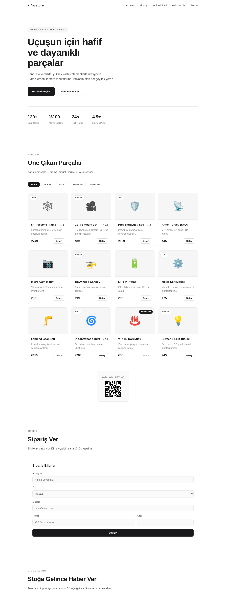

# fpvstore — Atölye Vitrin Sitesi

3D yazıcı ile üretilen **drone (FPV) parçaları** satan bir atölyenin tanıtım/vitrin web sitesi.
**React + Vite** ile geliştirilmiştir. AtölyeKart Hafta 1 ödevi kapsamında hazırlanmıştır.



## Özellikler

- 🛒 **Ürün kataloğu** — varyantlı ürünler (SKU, malzeme, renk, fiyat, stok), kategori filtresi
- 🏷️ **Türetilmiş alanlar** — `priceFrom`, `inStock`, `averageRating`, `reviewCount` servis katmanında hesaplanır
- 📦 **Sipariş Ver** ve 🔔 **Stok Bildirimi** akışları (webhook'a bağlı formlar)
- 🔗 **Webhook veri katmanı** — tüm gönderimler ortak zarf kullanır: `{ event, source, id, createdAt, data }`
- 📱 **QR kod** — katalog bölümünde (`qrcode.react`)
- 💅 Minimalist / gri, kurumsal tasarım; mobil uyumlu (responsive)

## Teknoloji

- React 18 + Vite 5 (JavaScript / JSX)
- `qrcode.react`
- Node 22 / npm 10 önerilir

## Kurulum ve Çalıştırma

```bash
npm install
cp .env.example .env      # VITE_WEBHOOK_URL değerini webhook.site adresinle doldur
npm run dev               # http://localhost:5173
npm run build             # production derlemesi
npm run preview           # derlemeyi önizle
```

## Ortam Değişkenleri

| Değişken | Açıklama |
|----------|----------|
| `VITE_WEBHOOK_URL` | Webhook alıcı adresi (ör. webhook.site'tan alınan URL). Boşsa gönderim yapılmaz. |

## Proje Yapısı

```
index.html                Vite giriş noktası (#root + src/main.jsx)
src/
  main.jsx                React kök render
  App.jsx                 Bölümleri birleştirir
  index.css               Tüm global stiller
  components/             Header, Hero, About, Contact, Footer,
                          ProductList, ProductCard, ProductImage,
                          OrderForm, StockNotify
  services/               Webhook'a hazır async veri katmanı
                          (productService, materialService, reviewService,
                           orderService, stockNotifyService, customPrintService, webhook)
  data/                   Statik seed veri (categories, materials, products, reviews...)
  models/types.js         JSDoc @typedef tanımları
  utils/format.js         formatPrice(amount, currency)
docs/                     Ekran görüntüsü
```

## Mimari Kararlar

- **Veri erişimi tamamen `services/*` arkasında (async).** Bileşenler doğrudan veriye değil servise bağlıdır; ileride webhook/API'ye geçiş bileşenleri etkilemez.
- **Ürünler varyantlı:** her varyantın kendi `sku / materialId / color / price / currency / stock` değeri vardır. Stok 0 ise "Stokta yok" rozeti gösterilir ve buton devre dışı kalır.
- Türetilen alanlar veride tutulmaz, `productService` içinde hesaplanır.

## Webhook Veri Sözleşmesi

Tüm webhook'lar ortak zarf kullanır: `{ event, source: 'fpvstore', id, createdAt, data }` (`src/services/webhook.js`).

| Event | `data` alanları |
|-------|-----------------|
| `order.created` | `name, productId, productName, phone, email, quantity` |
| `stock.notify_requested` | `name, productId, productName, email` |

## İlgili Dosyalar

- `TESLIM.md` — ödev teslim kontrol listesi ve madde durumları
- `webhook-kanit.md` — webhook.site gönderim kanıtları
- `KISA-DUSUNCE.md` — kısa düşünce / refleksiyon yanıtları
- `CLAUDE.md` — proje bağlamı ve geliştirme notları

---

Geliştiren: **İbrahim Yusuf Karagül**
